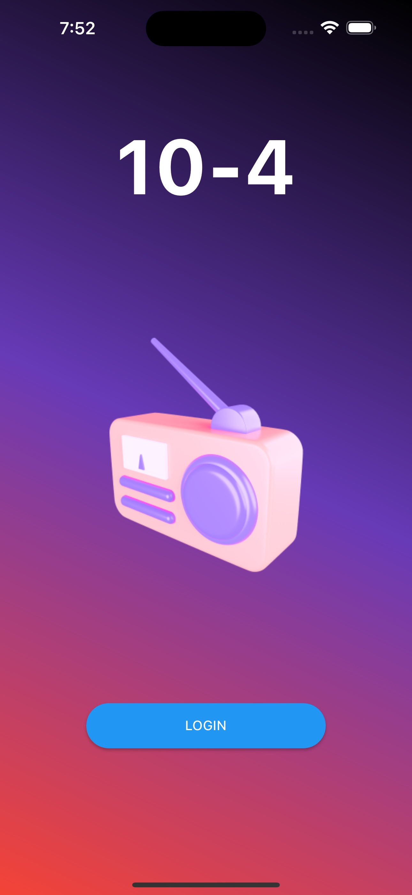
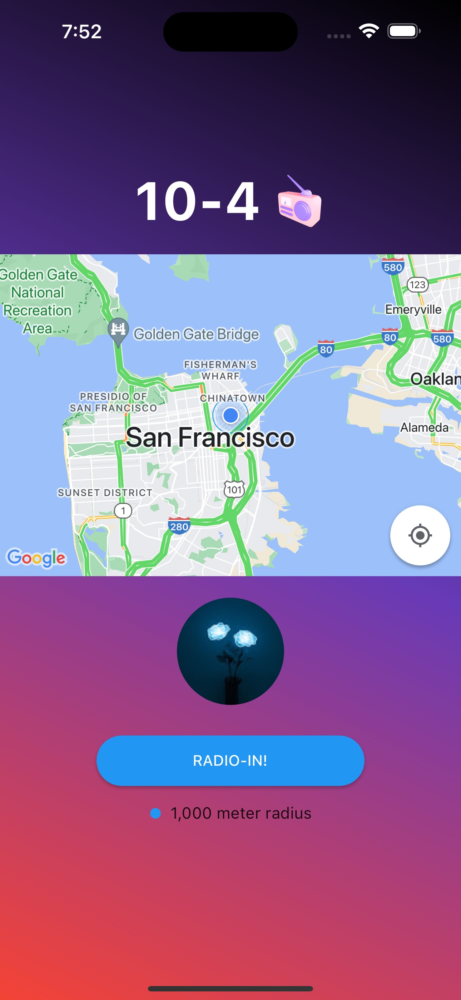
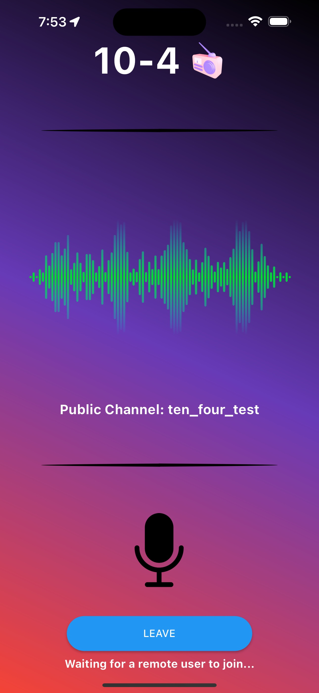

# 10-4

## Description

An app that allows drivers on the road talk to each other in real time.

Have you ever wanted to talk to other drivers on the road to tell them to have a great day? Or maybe you wanted to host your own personal broadcast show. 10-4 is here for you. Using the Agora API, you can host a show on your own channel, or have a personal channel with someone you know. You can log yourself in, choose between multiple channels, and listen to what everyone else is saying. It's basically a long range walkie talkie!

## Features

Login Page | Home Page | Radio Channel Page
---|---|---
|  | 
We use AuthO to let the user log into the application.|The user can see their location once they accept the app's Location Permissions, and they have the option to radio in. They can also see how far away of drivers they can connect with.|Here, they can join a channel and communicate with other drivers. You have the option to mute yourself as well.

## Software Used

- Flutter/Dart: [docs](https://docs.flutter.dev)
- Flutter Geolocator Plugin: [docs](https://pub.dev/packages/geolocator)
- Google Maps API: [docs](https://developers.google.com/maps/documentation/ios-sdk)
- Express Node: [docs](https://expressjs.com/en/4x/api.html)
- Agora API: [docs](https://docs.agora.io/en/)
- AuthO: [docs](https://auth0.com/docs/api)
- Flutter API: [docs](https://api.flutter.dev)

## Credits

- Sid Sabhnani: [Github](https://github.com/sidsabh)
- Nikshita Kurva: [Github](https://github.com/nikshitak)
- Shriya Danam: [Github](https://github.com/shriyad27)
- Vibha Kolathaya: [Github](https://github.com/vibha-k)
